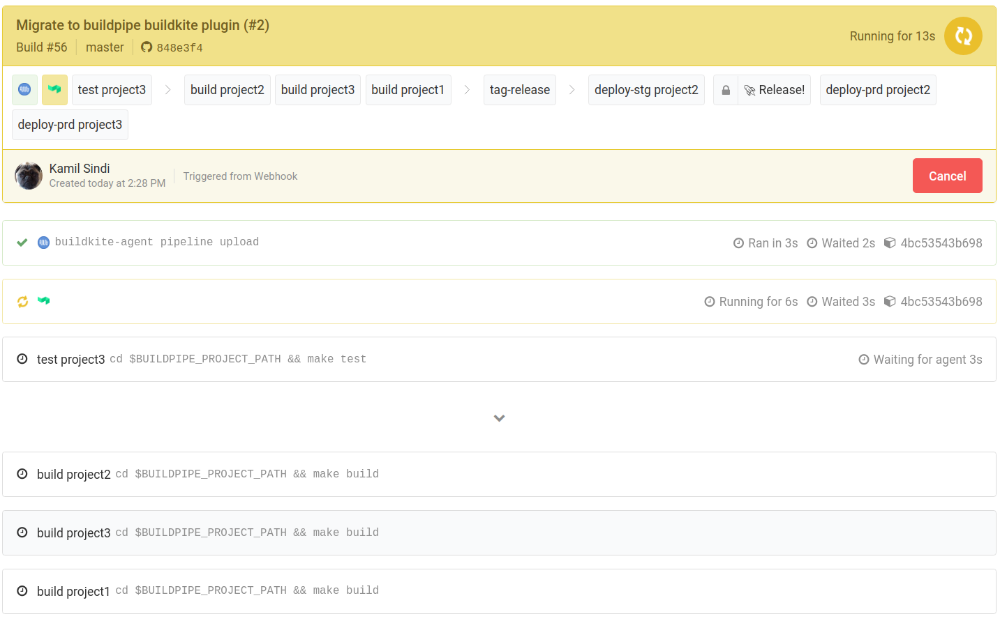

Buildpipe
=========

A Buildkite plugin to dynamically generate pipelines. Especially useful
for monorepos where you want to create dependencies between projects.

Example
-------



### initial\_pipeline.yml

```yaml
steps:
  - label: ":buildkite:"
    plugins:
      - jwplayer/buildpipe#v0.7.4:
          dynamic_pipeline: dynamic_pipeline.yml
          projects:
           - label: project1
             path: project1/  # changes in this dir will trigger steps for project1
             skip:
               - test  # skip steps with label test
               - deploy*  # skip steps with label matching deploy* (e.g. deploy-prd)
           - label: project2
             skip: test
             path: project2/
           - label: project3
             skip: deploy-stg
             path:
               - project3/
               - project2/somedir/  # project3 steps will also be triggered by changes in this dir
```

### dynamic\_pipeline.yml

```yaml
steps:
  - label: test
    env:
      BUILDPIPE_SCOPE: project  # this variable ensures a test step is generated for each project
    command:
      - cd $$BUILDPIPE_PROJECT_PATH
      - make test
  - wait
  - label: build
    branches: "master"
    env:
      BUILDPIPE_SCOPE: project
    command:
      - cd $$BUILDPIPE_PROJECT_PATH
      - make build
      - make publish-image
    agents:
      - queue=build
  - wait
  - label: tag
    branches: "master"
    command:
      - make tag-release
  - wait
  - label: deploy-staging
    branches: "master"
    env:
      BUILDPIPE_SCOPE: project
    command:
      - cd $$BUILDPIPE_PROJECT_PATH
      - make deploy-staging
  - wait
  - block: ":rocket: Release!"
    branches: "master"
  - wait
  - label: deploy-prod
    branches: "master"
    env:
      BUILDPIPE_SCOPE: project
    command:
      - cd $$BUILDPIPE_PROJECT_PATH
      - make deploy-prod
```

The above pipelines specify the following:

-   There are three projects to track in the repository.
-   The env variable `BUILDPIPE_SCOPE: project` tells buildpipe to
    generate a step for each project if that project changed.
-   The `skip` option will skip any step label matching `deploy*`.
-   The env variable `BUILDPIPE_PROJECT_PATH` is created by buildpipe as
    the project\'s path. If multiple paths are specified for a project,
    it\'s the first path.

### Full working example

For a full working example, check out [Buildkite Monorepo Example](https://github.com/ksindi/buildkite-monorepo-example).

Configuration
-------------

### Plugin

| Option            | Required | Type   | Default | Description
| ----------------- | -------- | ------ | ------- | -------------------------------------------------- |
| dynamic\_pipeline | Yes      | string |         | The name including the path to the pipeline that contains all the actual steps |
| diff              | No       | string |         | Can be used to override the default commands (see below for a better explanation of the defaults) |
| log\_level        | No       | string | INFO    | The Level of logging to be used by the python script underneath; pass DEBUG for verbose logging if errors occur |
| projects          | Yes      |  array |         | List of projects that buildpipe will run steps for |

### Project

| Option | Required | Type   | Default | Description                           |
| ------ | -------- | ------ | ------- | ------------------------------------- |
| label  | Yes      | string |         | Project label                         |
| path   | Yes      | array  |         | The path(s) that specify changes to a project |
| skip   | No       | array  |         | Exclude steps that have labels that match the rule |

Other useful things to note:

-   Option `skip` make use of Unix shell-style wildcards (Look at
    .gitignore files for inspiration)
-   If multiple paths are specified, the environment variable
    `BUILDPIPE_PROJECT_PATH` will be the first path.

`diff` command
--------------

Depending on your [merge
strategy](https://help.github.com/en/github/administering-a-repository/about-merge-methods-on-github),
you might need to use different diff command.

Buildpipe assumes you are using a merge strategy on the master branch.


Requirements
------------

Python3 is currently required, but we are [planning](https://github.com/jwplayer/buildpipe-buildkite-plugin/issues/43) to convert buildpipe to a binary using Go.

Just make sure to install Python3 in your agent bootstrap script or Dockerfile.


#### Cloudformation bootstrap script

```bash
# Install python3
yum -y install python3 python3-pip
pip3 install -U setuptools wheel
```

#### Agent Dockerfile

```
FROM buildkite/agent:3.0

RUN apk add --no-cache \
  # Languages
  python3 py-setuptools
```


Troubleshooting
---------------

### Buildpipe is incorrectly showing project as changed

Buildkite doesn\'t by default do clean checkouts. To enable clean
checkouts set the `BUILDKITE_CLEAN_CHECKOUT` [environment variable](https://buildkite.com/docs/pipelines/environment-variables). An
example is to modify the pre-checkout hook,
`.buildkite/hooks/pre-checkout`:

```bash
#!/bin/bash
set -euo pipefail

echo '--- :house_with_garden: Setting up pre-checkout'

export BUILDKITE_CLEAN_CHECKOUT="true"
```

Testing
-------

```bash
make test
```

License
-------

MIT

Acknowledgements
----------------

The rewrite to a plugin was inspired by
[git-diff-conditional-buildkite-plugin](https://github.com/Zegocover/git-diff-conditional-buildkite-plugin).
